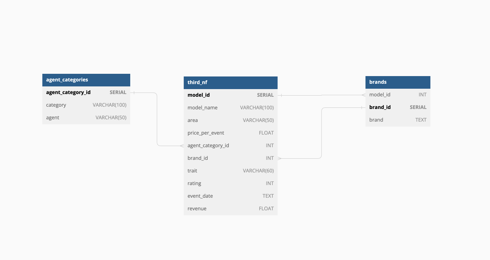
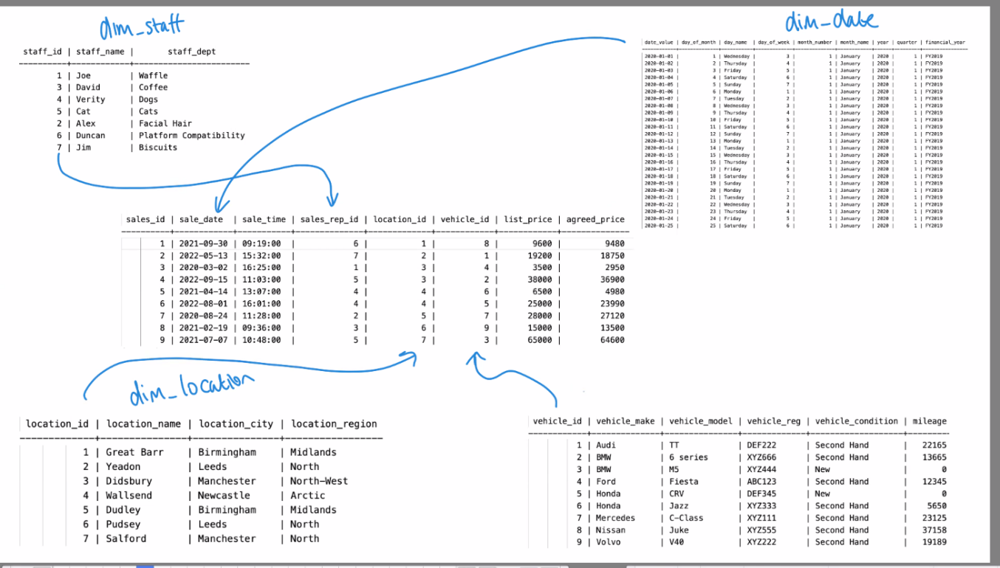
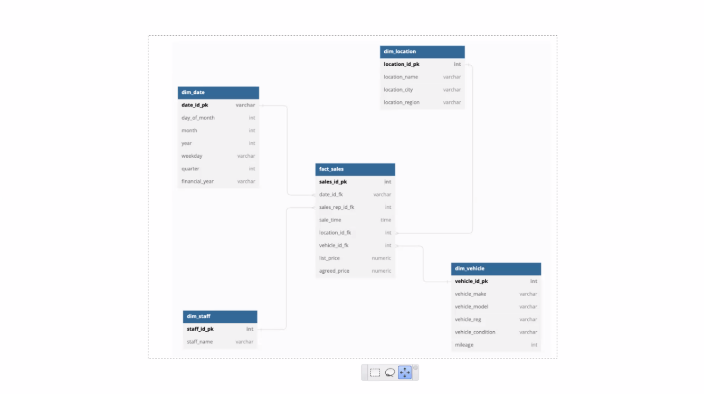

# Data modelling and data-warehouse design 📊

## Objective 🎯

Transform existing data on models and modelling agencies into a more organized and efficient structure for analysis. This involved normalizing the data and then implementing a star schema, along with creating Entity Relationship Diagrams (ERDs) to visualize the transformations.

-   Refactor a table to 1NF, 2NF and 3NF 📝
-   Implement a star schema ⭐
-   Implement an ERD 🗺️

---

## Part I - OLTP 📂

### Normalizing the Data **without mutating** our original data:

In this phase, the focus was on achieving data normalization up to the third normal form (3NF), ensuring data integrity and reducing redundancy.

**Step 1: First Normal Form (1NF)** 1️⃣

1. Removed duplicate rows.
2. Ensured each cell contained a single value.
3. Verified that values couldn't be further subdivided.

Output saved to `1NF.txt`.

**Step 2: Second Normal Form (2NF)** 2️⃣

1. Confirmed adherence to 1NF.
2. Eliminated partial dependencies, ensuring non-prime attributes depended on the candidate key.

Output saved to `2NF.txt`.

**Step 3: Third Normal Form (3NF)** 3️⃣

1. Validated compliance with 2NF.
2. Removed transitive dependencies by linking fields to the primary/composite key.

Output saved to `3NF.txt`.

**Step 4: Entity Relationship Diagram (ERD) for Normalized Data** 📈

Utilized [dbdiagram.io](https://dbdiagram.io/home) to craft an ERD representing the normalized data in its third normal form. A screenshot of the ERD was captured and added to the repository.

---

## Part II - OLAP 📂

### Implementing a Star Schema ⭐

In this phase, the aim was to optimize the database for analysis by transitioning to a star schema, which enhances performance and simplifies querying.

**Step 1: Building a Star Schema**

1. Identified relevant dimensions for extraction.
2. Designed fact tables and established connections to dimensions.

**Step 2: Updated Entity Relationship Diagram (ERD) for Star Schema**

## Conclusion 🔚

Through a meticulously planned and executed series of steps, the data has been successfully transformed and optimized for analysis. The achievement of normalizing the data and implementing a star schema demonstrates a significant enhancement in data organization and accessibility, setting the stage for more effective modeling and analysis processes.

